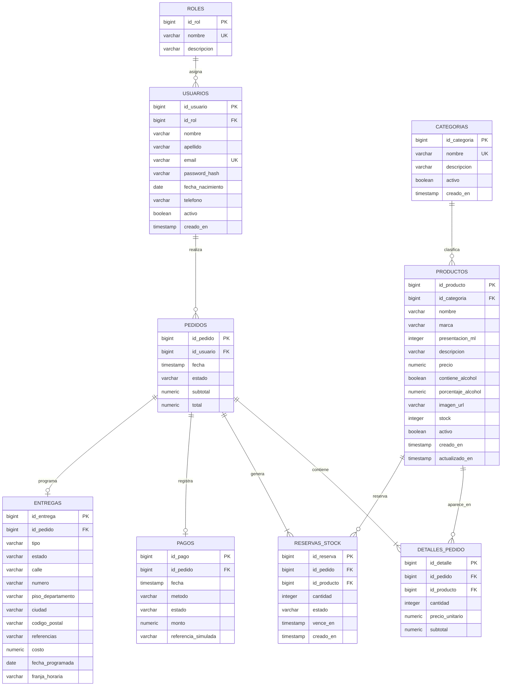

# Brinda Express — Modelo de datos

**Proyecto:** E-commerce full-stack de bebidas  
**Tecnologías planificadas:** PostgreSQL, Node.js, Express y React  
**Metodología:** Scrum  
**Versión del modelo:** 1.0  
**Fecha:** 23 de agosto de 2026  
**Estado:** Modelo inicial aprobado

## 1. Objetivo

Definir el modelo de datos inicial de Brinda Express, un e-commerce de bebidas con y sin alcohol. El sistema permitirá registrar clientes, administrar el catálogo, realizar pedidos, reservar stock durante el checkout, simular pagos y gestionar entregas inmediatas o programadas.

## 2. Alcance funcional

### Cliente

- Registro e inicio de sesión.
- Consulta de productos organizados por categorías.
- Carrito disponible durante la sesión.
- Inicio del checkout y reserva temporal de stock.
- Pago simulado.
- Consulta de pedidos.
- Delivery inmediato.
- Entrega programada por fecha y franja horaria.
- Dirección ingresada en cada pedido.

### Administrador

- Inicio de sesión con rol Administrador.
- Panel básico de administración.
- Gestión de categorías y productos.
- Actualización del stock.
- Consulta de pedidos.
- Actualización de estados de pedidos y entregas.

## 3. Reglas de negocio

1. Para comprar será obligatorio registrarse e iniciar sesión.
2. Existirán los roles Cliente y Administrador.
3. Cada presentación o tamaño será un producto diferente.
4. Habrá un único stock general.
5. El carrito existirá solamente durante la sesión y no se guardará en PostgreSQL.
6. Agregar un producto al carrito no reservará stock.
7. Al iniciar el checkout se creará un pedido con estado `pendiente_pago`.
8. El checkout reservará las unidades solicitadas durante 30 minutos.
9. No se podrá reservar ni comprar una cantidad superior al stock disponible.
10. Un pago simulado aprobado confirmará el pedido y descontará definitivamente el stock.
11. Un pago rechazado o una reserva vencida cancelará el pedido y liberará las unidades.
12. Cada pedido tendrá un solo intento de pago en esta versión.
13. La fecha de nacimiento será obligatoria durante el registro.
14. Para comprar productos alcohólicos, el cliente deberá ser mayor de 18 años y confirmarlo durante el checkout.
15. Cada producto deberá indicar si contiene alcohol.
16. Cada pedido conservará la dirección utilizada para esa entrega.
17. La entrega podrá ser inmediata o programada.
18. La entrega programada requerirá una fecha y una franja horaria.
19. El administrador podrá actualizar el estado de los pedidos y las entregas.

## 4. Entidades

| Entidad | Responsabilidad |
|---|---|
| `roles` | Definir los permisos de Cliente y Administrador. |
| `usuarios` | Guardar las personas registradas, sus credenciales protegidas y su rol. |
| `categorias` | Organizar el catálogo de bebidas. |
| `productos` | Representar cada bebida y presentación disponible para la venta. |
| `pedidos` | Representar cada proceso de compra iniciado por un cliente. |
| `detalles_pedido` | Guardar los productos, cantidades y precios incluidos en un pedido. |
| `reservas_stock` | Registrar las unidades reservadas temporalmente durante el checkout. |
| `pagos` | Registrar el resultado de la simulación del pago. |
| `entregas` | Guardar la modalidad, dirección, programación y estado de la entrega. |

## 5. Diccionario de datos inicial

### `roles`

| Atributo | Clave | Requerido | Descripción |
|---|---|---:|---|
| `id_rol` | PK | Sí | Identificador interno del rol. |
| `nombre` | UK | Sí | Nombre único: Cliente o Administrador. |
| `descripcion` | — | No | Explicación de los permisos del rol. |

### `usuarios`

| Atributo | Clave | Requerido | Descripción |
|---|---|---:|---|
| `id_usuario` | PK | Sí | Identificador interno del usuario. |
| `id_rol` | FK | Sí | Rol asignado al usuario. |
| `nombre` | — | Sí | Nombre del usuario. |
| `apellido` | — | Sí | Apellido del usuario. |
| `email` | UK | Sí | Correo único utilizado para iniciar sesión. |
| `password_hash` | — | Sí | Contraseña transformada; nunca se guarda la contraseña real. |
| `fecha_nacimiento` | — | Sí | Fecha utilizada para validar la mayoría de edad. |
| `telefono` | — | Sí | Teléfono de contacto. |
| `activo` | — | Sí | Indica si la cuenta se encuentra habilitada. |
| `creado_en` | — | Sí | Fecha y hora de creación de la cuenta. |

### `categorias`

| Atributo | Clave | Requerido | Descripción |
|---|---|---:|---|
| `id_categoria` | PK | Sí | Identificador interno de la categoría. |
| `nombre` | UK | Sí | Nombre único de la categoría. |
| `descripcion` | — | No | Descripción de la categoría. |
| `activo` | — | Sí | Permite ocultarla sin eliminarla físicamente. |
| `creado_en` | — | Sí | Fecha y hora de creación. |

### `productos`

| Atributo | Clave | Requerido | Descripción |
|---|---|---:|---|
| `id_producto` | PK | Sí | Identificador interno del producto. |
| `id_categoria` | FK | Sí | Categoría a la que pertenece. |
| `nombre` | — | Sí | Nombre comercial. |
| `marca` | — | Sí | Marca del producto. |
| `presentacion_ml` | — | Sí | Contenido del envase expresado en mililitros. |
| `descripcion` | — | No | Información adicional. |
| `precio` | — | Sí | Precio vigente. |
| `contiene_alcohol` | — | Sí | Indica si requiere validación de mayoría de edad. |
| `porcentaje_alcohol` | — | Condicional | Graduación alcohólica; se usa cuando contiene alcohol. |
| `imagen_url` | — | No | Dirección de la imagen del producto. |
| `stock` | — | Sí | Cantidad física general. |
| `activo` | — | Sí | Permite ocultarlo sin borrar su historial. |
| `creado_en` | — | Sí | Fecha y hora de creación. |
| `actualizado_en` | — | Sí | Fecha y hora de la última modificación. |

### `pedidos`

| Atributo | Clave | Requerido | Descripción |
|---|---|---:|---|
| `id_pedido` | PK | Sí | Identificador interno del pedido. |
| `id_usuario` | FK | Sí | Cliente que realizó el pedido. |
| `fecha` | — | Sí | Fecha y hora de inicio del checkout. |
| `estado` | — | Sí | Estado actual del pedido. |
| `subtotal` | — | Sí | Suma de los productos. |
| `total` | — | Sí | Importe final, incluido el costo de entrega. |

Estados iniciales: `pendiente_pago`, `confirmado`, `en_preparacion`, `enviado`, `entregado` y `cancelado`.

### `detalles_pedido`

| Atributo | Clave | Requerido | Descripción |
|---|---|---:|---|
| `id_detalle` | PK | Sí | Identificador interno del detalle. |
| `id_pedido` | FK | Sí | Pedido al que pertenece. |
| `id_producto` | FK | Sí | Producto comprado. |
| `cantidad` | — | Sí | Unidades solicitadas. |
| `precio_unitario` | — | Sí | Precio del producto al momento de comprar. |
| `subtotal` | — | Sí | Cantidad multiplicada por el precio unitario. |

### `reservas_stock`

| Atributo | Clave | Requerido | Descripción |
|---|---|---:|---|
| `id_reserva` | PK | Sí | Identificador interno de la reserva. |
| `id_pedido` | FK | Sí | Pedido pendiente que originó la reserva. |
| `id_producto` | FK | Sí | Producto reservado. |
| `cantidad` | — | Sí | Unidades reservadas. |
| `estado` | — | Sí | Estado actual de la reserva. |
| `vence_en` | — | Sí | Momento exacto en que finalizan los 30 minutos. |
| `creado_en` | — | Sí | Fecha y hora de creación. |

Estados iniciales: `activa`, `consumida`, `liberada` y `vencida`.

### `pagos`

| Atributo | Clave | Requerido | Descripción |
|---|---|---:|---|
| `id_pago` | PK | Sí | Identificador interno del pago. |
| `id_pedido` | FK | Sí | Pedido pagado. |
| `fecha` | — | Sí | Fecha y hora de la simulación. |
| `metodo` | — | Sí | Método utilizado en la simulación. |
| `estado` | — | Sí | Resultado del pago. |
| `monto` | — | Sí | Importe simulado. |
| `referencia_simulada` | — | No | Código ficticio de la operación. |

Estados iniciales: `pendiente`, `aprobado` y `rechazado`.

### `entregas`

| Atributo | Clave | Requerido | Descripción |
|---|---|---:|---|
| `id_entrega` | PK | Sí | Identificador interno de la entrega. |
| `id_pedido` | FK | Sí | Pedido que debe entregarse. |
| `tipo` | — | Sí | Inmediata o programada. |
| `estado` | — | Sí | Estado actual de la entrega. |
| `calle` | — | Sí | Calle de destino. |
| `numero` | — | Sí | Altura de destino. |
| `piso_departamento` | — | No | Piso o departamento. |
| `ciudad` | — | Sí | Ciudad de destino. |
| `codigo_postal` | — | Sí | Código postal de destino. |
| `referencias` | — | No | Indicaciones adicionales. |
| `costo` | — | Sí | Costo de la entrega. |
| `fecha_programada` | — | Condicional | Obligatoria para una entrega programada. |
| `franja_horaria` | — | Condicional | Obligatoria para una entrega programada. |

## 6. Relaciones y cardinalidades

| Relación | Cardinalidad |
|---|---:|
| `roles` → `usuarios` | 1:N |
| `usuarios` → `pedidos` | 1:N |
| `categorias` → `productos` | 1:N |
| `pedidos` → `detalles_pedido` | 1:N |
| `productos` → `detalles_pedido` | 1:N |
| `pedidos` → `reservas_stock` | 1:N |
| `productos` → `reservas_stock` | 1:N |
| `pedidos` → `pagos` | 1:0..1 |
| `pedidos` → `entregas` | 1:0..1 |

La relación muchos a muchos entre pedidos y productos se resuelve mediante `detalles_pedido`.

## 7. Diagrama entidad-relación

## 8. Revisión de cobertura

| Requisito obligatorio | Entidades que lo cubren | Estado |
|---|---|---|
| Productos y categorías | `productos`, `categorias` | Cubierto |
| Carrito y pedidos | Carrito de sesión, `pedidos`, `detalles_pedido` | Cubierto |
| Stock | `productos`, `reservas_stock` | Cubierto |
| Entregas | `entregas` | Cubierto |
| Registro y roles | `usuarios`, `roles` | Cubierto |
| Pago simulado | `pagos` | Cubierto |
| Validación de edad | `usuarios`, `productos` | Cubierto |

## 9. Elementos fuera del alcance inicial

- Pagos reales y pasarelas de pago.
- Seguimiento mediante GPS.
- Sistema logístico real.
- Aplicación para repartidores.
- Múltiples direcciones guardadas.
- Cupones, promociones y programa de puntos.
- Reseñas de productos.
- Integraciones externas de facturación.

## 10. Conclusión

El modelo inicial cubre los requisitos funcionales definidos para Brinda Express y mantiene separadas las responsabilidades de catálogo, usuarios, ventas, stock, pagos y entregas. Está preparado para convertirse en un esquema físico de PostgreSQL durante el siguiente sprint, sujeto a los ajustes que pueda solicitar el tutor.
